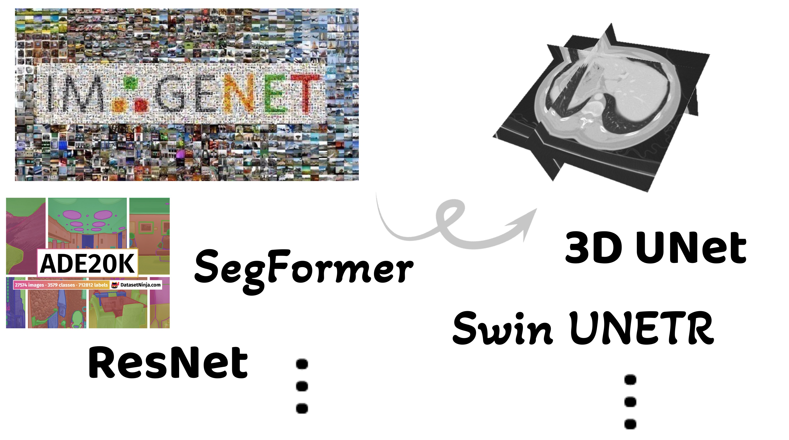

# M&N: Semi-Supervised 3D Medical Segmentation from 2D Natural Images Pretrained Model
<div align="center">
  
</div>

This repository contains the official PyTorch code for:
**Semi-Supervised 3D Medical Segmentation from 2D Natural Images Pretrained Model (M&N)** [[Project Page](https://pakheiyeung.github.io/M-N_wp/)][[Paper](https://arxiv.org/abs/2509.15167)][[Bibtex](resources/bibtex.bib)]

## Environment & Dependencies

This project is tested on Python 3.11 and PyTorch 2.3.1. All essential packages (except those basic packages like numpy) are listed in `requirements.txt`.

You may need to install CUDA and PyTorch according to your system and GPU. See the [PyTorch installation guide](https://pytorch.org/get-started/locally/) for details.

Install dependencies:
```bash
pip install -r requirements.txt
```

## Getting Started

### 1. Setup
- **Dataset paths:** In `utilities.py`, update the dataset paths in the `Split_dataset` class to match your local setup.
- **Custom datasets:** If using a new dataset (other than Pancreas-CT or LA), add a new `dataset_xxx` class in `dataset.py` (inheriting from `Base_dataset`) and update the `pick_dataset()` method. Also update the `import_dataset()` method in `Split_dataset` (in `utilities.py`) with the new dataset's path and info.
- **System:** In `hyperparameters.py`, modify the `system()` method of the `Hyperparameters_base` class as needed. This is also related to the dataset import logic above. We only tested our code on Ubuntu. If you are using other OS systems, our code may not directly work and may need some finetuning.

### 2. Training
- **Initialize hyperparameters:** Edit the hyperparameters and configuration in the `Hyperparameters` class in `hyperparameters.py`. The default settings are for a single NVIDIA RTX 6000 Ada GPU (48GB); adjust as needed for your hardware. Then run:
  ```bash
  python hyperparameters.py
  ```
  This will create a `<hp_name>.json` file in `./experiments/<save_path>`. You can edit your own `hp_name` and `save_path` in `hyperparameters.py`.

- **Train:**
  ```bash
  python train.py --save_path <save_path> --hp_name <hp_name.json>
  ```

### 3. Testing
  ```bash
  python test.py --save_path <save_path> --hp_name <hp_name.json>
  ```

## Trained Models

To use a trained model (e.g., `nih_6_pseudo`), run:
```bash
python test.py --save_path nih_6_pseudo --hp_name hyperparameters.json
```

| Dataset | Labeled Images Used | Model |
|---------|--------------------|-------|
| [Pancreas-CT](https://wiki.cancerimagingarchive.net/display/Public/Pancreas-CT) | 6 | [nih_6_pseudo](experiments/nih_6_pseudo/) |
| [MRI LA Cavity](https://www.cardiacatlas.org/atriaseg2018-challenge/atria-seg-data/) | 4 | [la_4_pseudo](experiments/la_4_pseudo/) |
| [MRI LA Cavity](https://www.cardiacatlas.org/atriaseg2018-challenge/atria-seg-data/) | 8 | [la_8_pseudo](experiments/la_8_pseudo/) |


## Citation
If you use this codebase, please cite:
```bibtex
@inproceedings{yeung2025m&n,
  title={Semi-Supervised 3D Medical Segmentation from 2D Natural Images Pretrained Model},
  author={Yeung, Pak-Hei and Ramesh, Jayroop and Lyu, Pengfei and Namburete, Ana and Rajapakse, Jagath C},
  booktitle={Machine Learning in Medical Imaging (MLMI)},
  year={2025}
}
```


